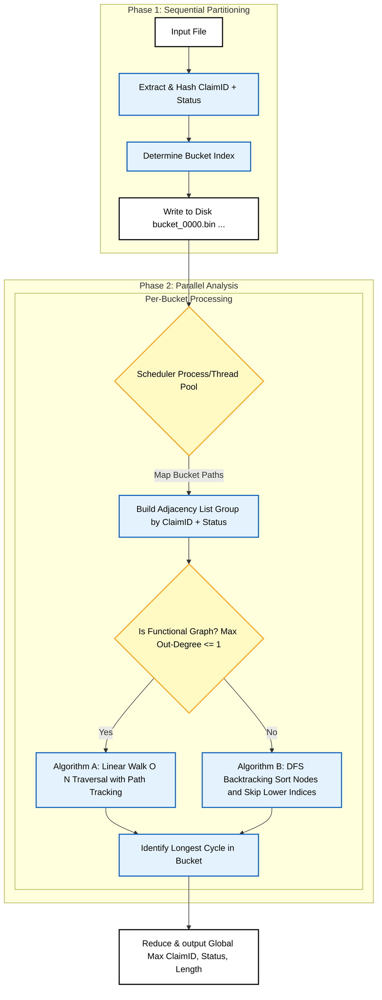

# Routing Cycle Detector

A high-performance CLI tool for finding the longest directed cycle in large routing claim datasets. Designed for files with millions of records, it uses a two-pass streaming architecture with on-disk bucketing to minimize memory usage while enabling parallel processing. The tool leverages Python 3.14's free-threading (no-GIL) for efficient multi-threaded execution when available, falling back to multiprocessing when the GIL is enabled.

**Input format:** `Source|Destination|ClaimID|StatusCode` (pipe-delimited, one record per line)

**Output format:** `<claim_id>,<status_code>,<cycle_length>` (single CSV line to stdout)

---

## Quickstart

The solution is a standalone PEP 723 script that can be executed directly:

```bash
# Direct execution (requires executable permission)
./my_solution.py data/large_input_v1.txt

# Via Python interpreter
python3 my_solution.py data/large_input_v1.txt
```

**Output behavior:**
- Exactly one CSV line printed to **stdout**: `<claim_id>,<status_code>,<cycle_length>`
- Progress and diagnostic messages go to **stderr** (only when `--verbose` is used)

### CLI Options

```bash
./my_solution.py <input_file> [--buckets N] [--log-level {DEBUG,INFO,WARNING,ERROR}]
```

| Option | Default | Description |
|--------|---------|-------------|
| `--buckets` | 1024 | Number of partition buckets (must be power of 2) |
| `--log-level` | WARNING | Choices: DEBUG, INFO, WARNING, ERROR |

---

## How It Works

The algorithm uses a **two-pass streaming strategy** to handle arbitrarily large input files while keeping memory bounded:

### Pass 1: Partitioning

Stream the input file line-by-line in binary mode. For each record, compute a stable hash of `(claim_id, status_code)` using CRC32, then write the raw line bytes to the corresponding bucket file on disk. This ensures all edges belonging to the same `(claim_id, status_code)` graph land in the same bucket.

### Pass 2: Parallel Analysis

Process each non-empty bucket file independently. Within each bucket:
1. Build adjacency graphs grouped by `(claim_id, status_code)`
2. Find the longest simple cycle in each graph
3. Track the local best result

After all buckets complete, reduce results to find the global maximum cycle.

### Why This Architecture?

- **Bounded memory:** Only one bucket's data is in memory at a time per worker
- **Parallelism:** Buckets are independent; process them concurrently
- **Streaming I/O:** Never load the entire input file into memory
- **Cache-friendly:** CRC32 hashing groups related data together

---

## Implementation Details

### Partitioning and LRU File-Handle Cache

The partitioner uses an **LRU (Least Recently Used) cache** that keeps at most `MAX_OPEN_HANDLES` (default: 128) file handles open at once.This allows streaming to any number of buckets while respecting OS limits.

### Bytes-First Parsing

All parsing stays in bytes until the final output to avoid UTF-8 decode overhead on millions of lines:

- Use `line.rstrip(b"\n\r")` instead of `strip()` (faster, targeted)
- Use `line.split(b"|", 3)` with maxsplit to avoid allocating extra parts
- Store graph keys as `(claim_bytes, status_bytes)` tuples
- Only decode the winning result for final CSV output

### Graph Building: Deduplicated Adjacency Sets

For each `(claim_id, status_code)` group, build an adjacency structure:

```python
adj: dict[bytes, set[bytes]]  # source -> set of destinations
```

Using **sets** automatically deduplicates edges, which:
- Preserves the "functional graph" optimization when out-degree is actually ≤1
- Reduces work in cycle detection
- Handles duplicate input lines gracefully

While building, track the maximum out-degree to determine which cycle detection algorithm to use.

### Cycle Detection

Two algorithms based on graph structure:

#### Functional Graph Fast Path (O(N))

When `max_out_degree ≤ 1`, each node has at most one outgoing edge. Use a timestamp-based walk:

1. Walk from each unvisited node, recording position in path
2. If we revisit a node in the current path → cycle found
3. Cycle length = current position − first visit position

This is O(N) where N is the number of nodes.

#### General DFS with Minimum-Start-Node Rule

For graphs with branching (out-degree > 1), use DFS with backtracking. To avoid counting the same cycle multiple times:

1. Sort all nodes lexicographically
2. For each start node at index `i`, only explore neighbors with index ≥ `i`
3. A cycle is found when DFS returns to the start node

This ensures each simple cycle is discovered exactly once (from its lexicographically smallest node).

### Concurrency Model

The executor is selected based on GIL status at runtime:

| GIL Status | Executor | Why |
|------------|----------|-----|
| **Disabled** (free-threaded Python 3.14t) | `ThreadPoolExecutor` | True parallelism with shared memory; lower overhead |
| **Enabled** (standard Python) | `ProcessPoolExecutor` | Bypasses GIL via multiprocessing; higher memory cost |

When using `ProcessPoolExecutor`, we use `executor.map(..., chunksize=16)` to reduce IPC overhead by batching bucket assignments.

### Complexity and Trade-offs

| Component | Time Complexity | Space Complexity |
|-----------|-----------------|------------------|
| Partitioning | O(N) where N = input lines | O(bucket_count × buffer_size) |
| Bucket processing | O(E + V) for functional graphs | O(V + E) per bucket |
| | O(V! / (V-k)!) worst case for DFS | (bounded by graph size in bucket) |

**Trade-offs and future improvements:**
- **Bucket count tuning:** More buckets = smaller graphs but more files; fewer = larger graphs
- **Adaptive partitioning:** Could detect and split oversized groups
- **Memory-mapped I/O:** Could improve read performance for Pass 2
- **Faster hashing:** xxHash could replace CRC32 for marginal speedup
- **Progress metrics:** Add estimated completion time for very long runs

---

## Diagrams

### End-to-End Pipeline

Overview of the complete two-pass architecture from input to output:



---

## Benchmarking

### Methodology

The benchmark script `my_solution_benchmark_gil.py` provides a rigorous comparison of execution modes:

- **Rotating trial order:** Each trial rotates the execution order of configurations to distribute "second run wins" effects from OS page cache warming.
- **Warm-up runs:** Initial runs are discarded to eliminate cold-start bias.
- **Wall-clock timing:** Uses GNU `/usr/bin/time -v` for accurate elapsed time measurement.
- **Process-tree memory:** Uses `psutil` to sample RSS across the parent process and ALL child processes (recursively). This is critical because:
  - `ThreadPoolExecutor` (free-threaded): Single process, parent RSS ≈ total
  - `ProcessPoolExecutor` (GIL-enforced): Multiple worker processes; parent RSS alone hides 90%+ of actual memory usage

### Interpreting Results

#### Why holding the executor constant matters

A naïve "free-threaded vs GIL-enforced" comparison is **misleading** because it conflates two variables:

1. **GIL status:** Whether threads can run Python bytecode in parallel
2. **Executor type:** `ThreadPoolExecutor` (shared memory, single process) vs `ProcessPoolExecutor` (separate heaps, multiple processes)

By default, the solution uses threads when GIL is off and processes when GIL is on. This means a simple comparison doesn't isolate free-threading's benefit—it also includes the overhead/advantage of the executor itself.

The `--all-modes` benchmark runs a **2×2 matrix** to separate these effects:

| | GIL-off (free-threaded) | GIL-on (standard) |
|---|---|---|
| **ThreadPoolExecutor** | True parallelism | GIL serialization |
| **ProcessPoolExecutor** | Parallel (separate heaps) | Parallel (separate heaps) |

#### Why ProcessPoolExecutor can be faster (but uses more memory)

On allocation-heavy Python workloads, `ProcessPoolExecutor` sometimes outperforms threads because:

- **Separate heaps:** Each worker has its own memory allocator with no contention.
- **No GIL overhead:** Even with GIL-off, some internal locks remain; separate processes avoid all shared-state coordination.

The trade-off is **memory**: each worker duplicates interpreter state and working data. In the results below, processes use ~4× more memory than threads.

#### Why ThreadPool + GIL-on is slow for CPU-bound work

With the GIL enabled, only one thread can execute Python bytecode at a time. CPU-bound work cannot parallelize—threads just take turns. This is why the **threads-only comparison** (`--executor threads`) isolates the true free-threading benefit:

| Dataset | Threads GIL-off | Threads GIL-on | Speedup |
|---------|-----------------|----------------|---------|
| large_input_v1.txt | 17.1s | 28.6s | **1.67×** |
| synth_11m_nodes10_od2.txt | 11.5s | 66.8s | **5.81×** |

These speedups represent pure free-threading gains with no executor confound.

### What to Run

```bash
# Full 2×2 matrix (recommended for complete analysis)
./my_solution_benchmark_gil.py data/large_input_v1.txt --all-modes --trials 16

# Threads-only comparison (isolates free-threading benefit)
./my_solution_benchmark_gil.py data/large_input_v1.txt --trials 16 --executor threads

# Processes-only comparison (baseline for multiprocessing)
./my_solution_benchmark_gil.py data/large_input_v1.txt --trials 16 --executor processes
```

| Option | Default | Description |
|--------|---------|-------------|
| `--trials` | 7 | Number of timed trials per mode |
| `--warmup` | 1 | Warm-up runs per mode (not counted) |
| `--mem-sample-ms` | 75 | Memory sampling interval in milliseconds |
| `--all-modes` | off | Run full 2×2 matrix (threads/processes × GIL on/off) |
| `--executor` | auto | Force executor: `auto`, `threads`, or `processes` |
| `--synthetic` | off | Auto-generate input if file missing |

### Benchmark Results

#### Results: data/large_input_v1.txt

```
===============================================================================================
GIL Benchmark: Full 2×2 Matrix (Executor × GIL)
===============================================================================================
Input: data/large_input_v1.txt
Trials: 16 | Warm-up runs: 1
Mode: All combinations (threads×GIL-off, threads×GIL-on, procs×GIL-off, procs×GIL-on)
Memory sampling: 75ms interval (process-tree RSS via psutil)
Python: .../my-solution-benchmark-gil-bfd3788b0a2e0e6a/bin/python3
Wall-clock timing: GNU time

Warming up (1 run(s) per mode, not counted)...
  Warm-up complete.

Running 16 trials (rotating order to reduce bias)...
  Trial 1/16: threads+GIL-off=17.5s, threads+GIL-on=28.8s, procs+GIL-off=14.8s, procs+GIL-on=17.0s
  ...
  Trial 16/16: threads+GIL-off=15.1s, threads+GIL-on=28.4s, procs+GIL-off=14.8s, procs+GIL-on=17.4s

===============================================================================================
RESULTS (2×2 Matrix: Executor × GIL)
===============================================================================================
Executor     GIL      Median(s)   Min(s)    Max(s)    Peak RSS(MiB)  Output              
-----------------------------------------------------------------------------------------------
threads      off      17.115      15.000    17.530    229.2          190211,190310,10    
threads      on       28.570      26.510    29.110    230.3          190211,190310,10    
processes    off      16.790      14.600    17.180    969.2          190211,190310,10    
processes    on       15.280      14.680    17.350    968.8          190211,190310,10    
-----------------------------------------------------------------------------------------------

SPEEDUPS (GIL-on / GIL-off ratio for each executor):

  Threads:   1.67x (GIL-off is 1.67x faster)
  Processes: 0.91x (GIL-on is 1.10x faster)

MEMORY COMPARISON:
  Threads GIL-off:   229.2 MiB
  Threads GIL-on:    230.3 MiB
  Processes GIL-off: 969.2 MiB
  Processes GIL-on:  968.8 MiB

===============================================================================================
```

#### Results: data/synth_11m_nodes10_od2.txt

```
===============================================================================================
GIL Benchmark: Full 2×2 Matrix (Executor × GIL)
===============================================================================================
Input: data/synth_11m_nodes10_od2.txt
Trials: 16 | Warm-up runs: 1
Mode: All combinations (threads×GIL-off, threads×GIL-on, procs×GIL-off, procs×GIL-on)
Memory sampling: 75ms interval (process-tree RSS via psutil)
Python: /home/victor/.cache/uv/environments-v2/my-solution-benchmark-gil-bfd3788b0a2e0e6a/bin/python3
Wall-clock timing: GNU time

Warming up (1 run(s) per mode, not counted)...
  Warm-up complete.

Running 16 trials (rotating order to reduce bias)...
  Trial 1/16: threads+GIL-off=11.5s, threads+GIL-on=66.8s, procs+GIL-off=9.1s, procs+GIL-on=11.5s
  ...
  Trial 16/16: threads+GIL-off=11.4s, threads+GIL-on=69.0s, procs+GIL-off=9.3s, procs+GIL-on=9.1s

===============================================================================================
RESULTS (2×2 Matrix: Executor × GIL)
===============================================================================================
Executor     GIL      Median(s)   Min(s)    Max(s)    Peak RSS(MiB)  Output              
-----------------------------------------------------------------------------------------------
threads      off      11.505      11.200    13.750    377.7          699,190310,10       
threads      on       66.810      66.480    69.050    298.3          699,190310,10       
processes    off      9.160       9.020     11.460    1751.6         699,190310,10       
processes    on       9.290       9.130     11.610    1751.0         699,190310,10       
-----------------------------------------------------------------------------------------------

SPEEDUPS (GIL-on / GIL-off ratio for each executor):

  Threads:   5.81x (GIL-off is 5.81x faster)
  Processes: 1.01x (GIL-off is 1.01x faster)

MEMORY COMPARISON:
  Threads GIL-off:   377.7 MiB
  Threads GIL-on:    298.3 MiB
  Processes GIL-off: 1751.6 MiB
  Processes GIL-on:  1751.0 MiB

===============================================================================================
```

### Key Observations

| Metric | large_input_v1.txt | synth_11m_nodes10_od2.txt |
|--------|-------------------|---------------------------|
| **Threads speedup (GIL-off vs GIL-on)** | 1.67× | 5.81× |
| **Processes speedup** | ~1.0× (GIL irrelevant) | ~1.0× (GIL irrelevant) |
| **Thread memory** | ~230 MiB | ~300-380 MiB |
| **Process memory** | ~969 MiB (4.2×) | ~1751 MiB (4.6×) |

**Takeaways:**

1. **Free-threading delivers real speedups** for CPU-bound cycle detection: 1.67× on real data, 5.81× on synthetic (which has denser graphs requiring more computation).

2. **ProcessPoolExecutor hides GIL overhead** but at significant memory cost (~4× more than threads). It's faster than threads+GIL-on but comparable to threads+GIL-off.

3. **Memory measurement matters:** Parent-only RSS (from `/usr/bin/time -v`) would show ~29 MiB for processes, hiding the 969 MiB actual usage. Process-tree measurement via `psutil` is essential for accurate comparison.

---

## Notes and Troubleshooting

### Bucket Count Must Be Power of Two

The partitioner uses bitwise AND for fast modulo: `bucket_idx = hash & (num_buckets - 1)`. This only works correctly when `num_buckets` is a power of two (e.g., 256, 512, 1024).

### "Too Many Open Files" Error

If you encounter file descriptor exhaustion:

1. **Check current limit:** `ulimit -n`
2. **Increase limit:** `ulimit -n 4096` (or higher)
3. **Or reduce cache size:** The `MAX_OPEN_HANDLES` constant in `partition.py` defaults to 128. Lowering it trades some I/O performance for fewer open files.

### WSL / Linux Notes

- **GNU time required:** Ensure `/usr/bin/time` exists (not the shell builtin). Install with:
  ```bash
  sudo apt install time
  ```
- **psutil required for benchmarking:** The benchmark script needs `psutil` for process-tree memory measurement:
  ```bash
  pip install psutil
  # or with uv:
  uv pip install psutil
  ```

### Python Version

This solution requires **Python 3.14+** for free-threading support. It will run on earlier versions but will use `ProcessPoolExecutor` (higher memory overhead).

---

## Project Structure

```
routing-cycle-detector/
├── my_solution.py                    # Main standalone solution (PEP 723)
├── my_solution_benchmark_gil.py      # Benchmark script
├── generate_synthetic_cycles.py      # Synthetic dataset generator
├── build.py                          # Bundles src/ into my_solution.py
├── solution.txt                      # Output from running on challenge data
├── explanation.txt                   # Brief algorithm summary
├── src/
│   ├── partition.py                  # Pass 1: Bucketing with LRU cache
│   ├── graph.py                      # Pass 2: Cycle detection
│   ├── scheduler.py                  # Orchestration and parallelism
│   └── main.py                       # CLI entry point
├── tests/
│   ├── test_partition.py
│   └── test_graph.py
├── data/
│   └── large_input_v1.txt            # Challenge dataset
└── diagrams/
    ├── End-to-End Pipeline.md
    └── Sequence Diagram.md
```

---