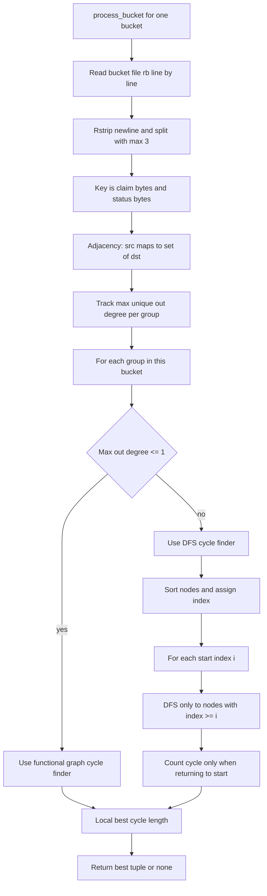

```mermaid
graph TD
  P[process_bucket for one bucket] --> R[Read bucket file rb line by line]
  R --> S[Rstrip newline and split with max 3]
  S --> T[Key is claim bytes and status bytes]
  T --> U[Adjacency: src maps to set of dst]
  U --> V[Track max unique out degree per group]

  V --> W[For each group in this bucket]
  W --> X{Max out degree <= 1}
  X -->|yes| Y[Use functional graph cycle finder]
  X -->|no| Z[Use DFS cycle finder]

  Z --> Z1[Sort nodes and assign index]
  Z1 --> Z2[For each start index i]
  Z2 --> Z3[DFS only to nodes with index >= i]
  Z3 --> Z4[Count cycle only when returning to start]

  Y --> AA[Local best cycle length]
  Z4 --> AA
  AA --> AB[Return best tuple or none]
```