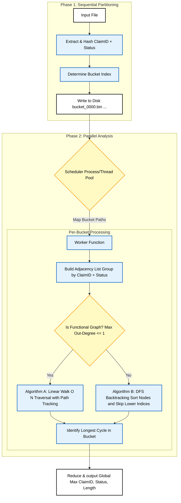

```mermaid
flowchart TD
    %% High contrast styling
    classDef storage fill:#ffffff,stroke:#000000,stroke-width:2px,color:#000000;
    classDef process fill:#e3f2fd,stroke:#1565c0,stroke-width:2px,color:#000000;
    classDef decision fill:#fff9c4,stroke:#f9a825,stroke-width:2px,color:#000000;

    subgraph Phase1 ["Phase 1: Sequential Partitioning"]
        Input["Input File"]:::storage --> ParseAndHash["Extract & Hash ClaimID + Status"]:::process
        ParseAndHash --> BucketIndex["Determine Bucket Index"]:::process
        BucketIndex --> DiskBuckets["Write to Disk bucket_0000.bin ..."]:::storage
    end

    subgraph Phase2 ["Phase 2: Parallel Analysis"]
        DiskBuckets --> Scheduler{"Scheduler Process/Thread Pool"}:::decision
        Scheduler -->|Map Bucket Paths| Worker["Worker Function"]:::process
        
        subgraph WorkerLogic ["Per-Bucket Processing"]
            Worker --> BuildGraph["Build Adjacency List Group by ClaimID + Status"]:::process
            BuildGraph --> CheckType{"Is Functional Graph? Max Out-Degree <= 1"}:::decision
            
            CheckType -- Yes --> AlgoFunctional["Algorithm A: Linear Walk O N Traversal with Path Tracking"]:::process
            CheckType -- No --> AlgoDFS["Algorithm B: DFS Backtracking Sort Nodes and Skip Lower Indices"]:::process
            
            AlgoFunctional --> LocalMax["Identify Longest Cycle in Bucket"]:::process
            AlgoDFS --> LocalMax
        end
    end

    LocalMax --> Output["Reduce & output Global Max ClaimID, Status, Length"]:::storage
```