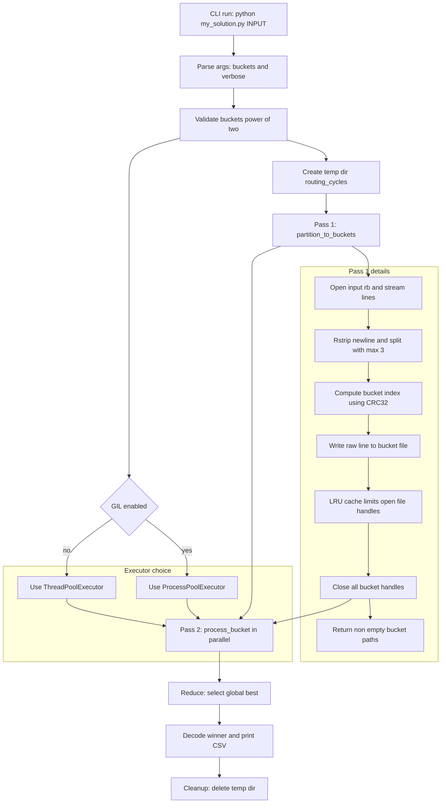

```mermaid
graph TD
  A[CLI run: python my_solution.py INPUT] --> B[Parse args: buckets and verbose]
  B --> C[Validate buckets power of two]
  C --> D{GIL enabled}
  D -->|yes| E[Use ProcessPoolExecutor]
  D -->|no| F[Use ThreadPoolExecutor]

  C --> G[Create temp dir routing_cycles]
  G --> H[Pass 1: partition_to_buckets]
  H --> I[Pass 2: process_bucket in parallel]
  I --> J[Reduce: select global best]
  J --> K[Decode winner and print CSV]
  K --> L[Cleanup: delete temp dir]

  subgraph PASS1[Pass 1 details]
    H1[Open input rb and stream lines] --> H2[Rstrip newline and split with max 3]
    H2 --> H3[Compute bucket index using CRC32]
    H3 --> H4[Write raw line to bucket file]
    H4 --> H5[LRU cache limits open file handles]
    H5 --> H6[Close all bucket handles]
    H6 --> H7[Return non empty bucket paths]
  end

  H --> H1
  H6 --> I

  subgraph EXEC[Executor choice]
    E --> I
    F --> I
  end
```