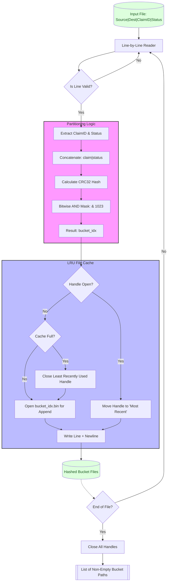

```mermaid
graph TD
    %% Source Data
    InputFile[("Input File: Source|Dest|ClaimID|Status")]
    
    %% Phase A: Extraction
    InputFile --> LineReader[Line-by-Line Reader]
    LineReader --> Filter{Is Line Valid?}
    Filter -- No --> LineReader
    Filter -- Yes --> Extractor[Extract ClaimID & Status]

    %% Phase B: Hashing Logic
    subgraph Hashing_Logic [Partitioning Logic]
        Extractor --> Concat["Concatenate: claim|status"]
        Concat --> CRC32[Calculate CRC32 Hash]
        CRC32 --> Mask[Bitwise AND Mask: & 1023]
        Mask --> BucketID[Result: bucket_idx]
    end

    %% Phase C: LRU Cache Management
    subgraph LRU_Cache_Manager [LRU File Cache]
        BucketID --> CheckCache{Handle Open?}
        
        CheckCache -- No --> FullCheck{Cache Full?}
        FullCheck -- Yes --> Evict[Close Least Recently Used Handle]
        FullCheck -- No --> OpenHandle[Open bucket_idx.bin for Append]
        Evict --> OpenHandle
        
        CheckCache -- Yes --> MoveToEnd[Move Handle to 'Most Recent']
        OpenHandle --> Write[Write Line + Newline]
        MoveToEnd --> Write
    end

    %% Phase D: Output
    Write --> Buckets[(Hashed Bucket Files)]
    Buckets -.-> Done{End of File?}
    Done -- No --> LineReader
    Done -- Yes --> CloseAll[Close All Handles]
    CloseAll --> FinalOutput[[List of Non-Empty Bucket Paths]]

    %% Styling
    style Hashing_Logic fill:#f9f,stroke:#333,stroke-width:2px
    style LRU_Cache_Manager fill:#bbf,stroke:#333,stroke-width:2px
    style InputFile fill:#dfd,color:#1b5e20
    style Buckets fill:#dfd,color:#1b5e20
```