```mermaid
graph TD
    %% Input: Bucket Files from Phase 1
    BucketFiles[("Bucket Files from Phase 1")]

    %% Executor Selection
    BucketFiles --> ExecutorSelect{GIL Status?}
    ExecutorSelect -- "Disabled (3.14t)" --> ThreadPool[ThreadPoolExecutor]
    ExecutorSelect -- "Enabled (Standard)" --> ProcessPool[ProcessPoolExecutor]

    ThreadPool --> MapBuckets[Map: process_bucket per path]
    ProcessPool --> MapBuckets

    %% Per-Bucket Processing
    subgraph Worker_Processing [Per-Bucket Processing]
        MapBuckets --> ReadBucket[Read Bucket File Binary]
        ReadBucket --> ParseLine["Parse: Source|Dest|ClaimID|Status"]

        subgraph Adjacency_Builder [Adjacency Builder]
            ParseLine --> GroupKey["Group Key: (ClaimID, Status)"]
            GroupKey --> AddEdge["Add Edge: adj[source].add(dest)"]
            AddEdge --> TrackDegree[Track Max Out-Degree]
            TrackDegree --> MoreLines{More Lines?}
            MoreLines -- Yes --> ParseLine
        end

        MoreLines -- No --> IterGroups[Iterate Each Group]
    end

    %% Cycle Detection Logic
    subgraph Cycle_Detection [Cycle Detection per Group]
        IterGroups --> CheckDegree{Max Out-Degree <= 1?}

        CheckDegree -- Yes --> FunctionalPath
        CheckDegree -- No --> DFSPath

        subgraph FunctionalPath [Functional Graph: O N Linear]
            FG_Start[Build next_node Map] --> FG_Walk[Walk From Each Unvisited Node]
            FG_Walk --> FG_Track[Track Position in Path]
            FG_Track --> FG_Check{Revisit Node in Path?}
            FG_Check -- Yes --> FG_Cycle[Cycle Length = pos - first_visit]
            FG_Check -- No --> FG_Continue[Continue to next_node]
            FG_Continue --> FG_End{Path Ends?}
            FG_End -- No --> FG_Track
            FG_End -- Yes --> FG_Next[Mark Path as Visited]
        end

        subgraph DFSPath [General Graph: DFS Backtracking]
            DFS_Sort[Sort Nodes Lexicographically] --> DFS_Start[For Each Start Node i]
            DFS_Start --> DFS_Explore[Explore Neighbors with idx >= i]
            DFS_Explore --> DFS_Check{Back to Start?}
            DFS_Check -- Yes --> DFS_Cycle[Record Cycle Length]
            DFS_Check -- No --> DFS_Recurse{Unvisited Neighbor?}
            DFS_Recurse -- Yes --> DFS_Explore
            DFS_Recurse -- No --> DFS_Backtrack[Backtrack]
        end

        FG_Cycle --> UpdateLocal[Update Local Best]
        FG_Next --> NextGroup{More Groups?}
        DFS_Cycle --> UpdateLocal
        DFS_Backtrack --> NextGroup
        UpdateLocal --> NextGroup
        NextGroup -- Yes --> IterGroups
    end

    %% Result Reduction
    NextGroup -- No --> WorkerResult[Return: claim_id, status, length or None]

    subgraph Result_Reduction [Global Reduction]
        WorkerResult --> Collect[Collect All Worker Results]
        Collect --> Compare{Result > Current Best?}
        Compare -- Yes --> UpdateGlobal[Update Global Best]
        Compare -- No --> MoreResults{More Results?}
        UpdateGlobal --> MoreResults
        MoreResults -- Yes --> Collect
        MoreResults -- No --> FinalResult
    end

    FinalResult[[Output: ClaimID, Status, Length]]

    %% Styling
    style Worker_Processing fill:#e1f5fe,stroke:#0288d1,stroke-width:2px,color:#01579b
    style Cycle_Detection fill:#fff3e0,stroke:#f57c00,stroke-width:2px,color:#e65100
    style FunctionalPath fill:#e8f5e9,stroke:#388e3c,stroke-width:2px,color:#1b5e20
    style DFSPath fill:#fce4ec,stroke:#c2185b,stroke-width:2px,color:#880e4f
    style Result_Reduction fill:#f3e5f5,stroke:#7b1fa2,stroke-width:2px,color:#4a148c
    style Adjacency_Builder fill:#e3f2fd,stroke:#1565c0,stroke-width:2px,color:#0d47a1
    style BucketFiles fill:#c8e6c9,color:#1b5e20
    style FinalResult fill:#c8e6c9,color:#1b5e20
```

## Algorithm Details

### Executor Selection
- **Free-threaded Python (3.14t)**: Uses `ThreadPoolExecutor` for true parallelism with shared memory
- **Standard Python**: Uses `ProcessPoolExecutor` to bypass GIL (higher memory overhead)
- **Environment override**: `RC_EXECUTOR=threads|processes|serial`

### Per-Bucket Processing
Each bucket file is processed independently:
1. **Read** bucket file in binary mode (no UTF-8 decode overhead)
2. **Parse** each line: `Source|Dest|ClaimID|Status`
3. **Group** edges by `(ClaimID, Status)` key
4. **Build** adjacency sets: `adj[source] -> set(destinations)`
5. **Track** maximum out-degree per group (determines algorithm choice)

### Cycle Detection Algorithms

#### Functional Graph Path (O(N))
Used when max out-degree ≤ 1 (each node has at most one outgoing edge):
- Build `next_node` mapping from adjacency sets
- Walk from each unvisited node, recording position in path
- Cycle detected when revisiting a node already in current path
- Cycle length = current position − first visit position

#### DFS with Minimum-Start-Node Rule
Used for general graphs with branching (out-degree > 1):
- Sort all nodes lexicographically
- For each start node at index `i`, only explore neighbors with index ≥ `i`
- Cycle found when DFS returns to the start node
- This ensures each simple cycle is discovered exactly once

### Result Reduction
- Each worker returns `(claim_id, status_code, cycle_length)` or `None`
- Main thread reduces results to find global maximum
- ProcessPoolExecutor uses `chunksize=16` to reduce IPC overhead
