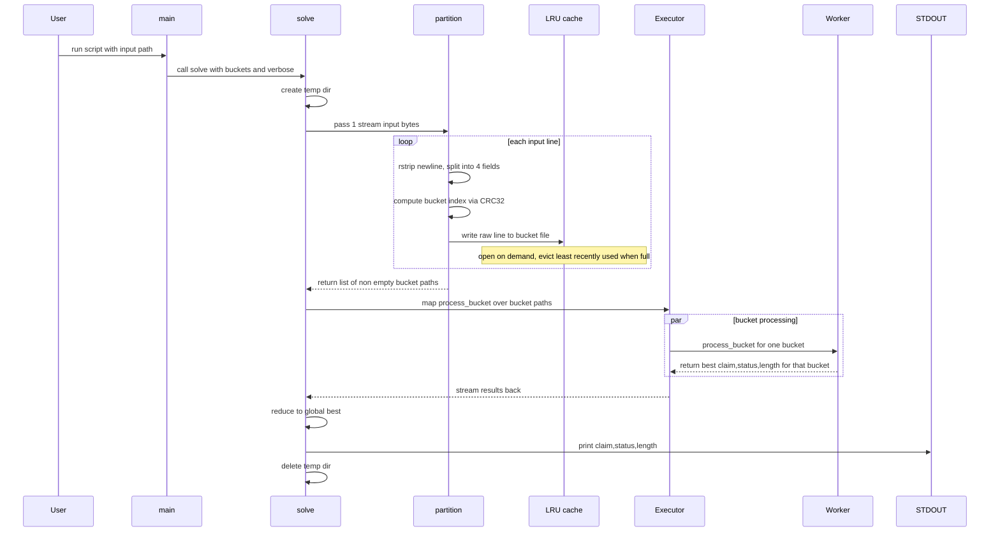

```mermaid
sequenceDiagram
  participant U as User
  participant CLI as main
  participant SOL as solve
  participant P1 as partition
  participant LRU as LRU cache
  participant EX as Executor
  participant W as Worker
  participant OUT as STDOUT

  U->>CLI: run script with input path
  CLI->>SOL: call solve with buckets and verbose
  SOL->>SOL: create temp dir
  SOL->>P1: pass 1 stream input bytes

  loop each input line
    P1->>P1: rstrip newline, split into 4 fields
    P1->>P1: compute bucket index via CRC32
    P1->>LRU: write raw line to bucket file
    Note over LRU: open on demand, evict least recently used when full
  end

  P1-->>SOL: return list of non empty bucket paths
  SOL->>EX: map process_bucket over bucket paths

  par bucket processing
    EX->>W: process_bucket for one bucket
    W-->>EX: return best claim,status,length for that bucket
  end

  EX-->>SOL: stream results back
  SOL->>SOL: reduce to global best
  SOL->>OUT: print claim,status,length
  SOL->>SOL: delete temp dir
```